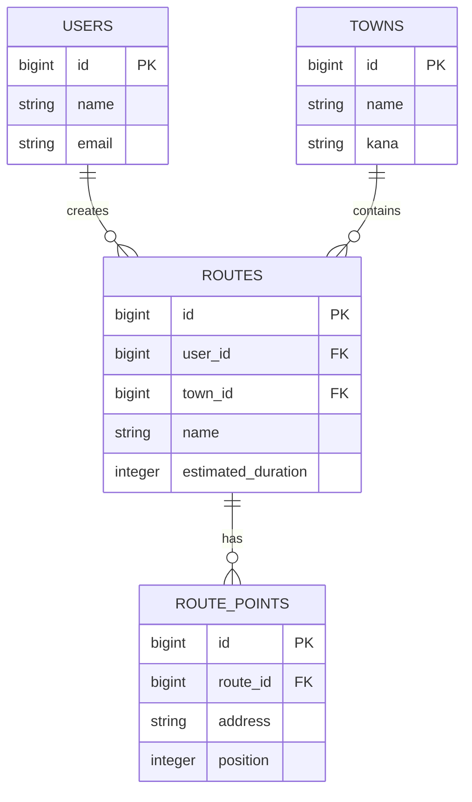

# Catch-up

ルート表示アプリです。
お店から配達する地域までの最短ルートを自分で登録、検索することができます。
スマホから操作でき、そのままグーグルマップにルートを反映できます。

## URL
https://delivery-catchup.com/
サイドメニューまたはトグルで「ゲストログイン」ボタンを押すだけで利用できます。

## 使用技術
**Backend**
* Ruby 3.2.10
* Ruby on Rails 8.1.3
  
**frontend**
* JavaScript (ES6)
* Bootstrap
* Sass
  
**Databese**
* PostgreSQL

**External API**
* Google Maps Platform

**Testing**
* Minitest
* Capybara
* Selenium WebDriver
* Jest

**Code Quality**
* RuboCop
* Brakeman
* Bundler Audit

**Infrastructure**
* Nginx
* Puma
* AWS
  - VPC
  - EC2
  - Route53

## AWS構成図

## 画面遷移図
黒矢印：ログイン前にも移動可能　赤矢印：ログイン後に移動可能

## ER図

  
## 機能一覧
* ユーザー登録・ログイン機能(bcrypt)
* 配送ルート作成機能
* 配送地点管理機能
* 地図表示機能(Google Maps JavaScript API)
* ルート検索機能(Google Directions API)
* ページネーション機能(kaminari)
* メール送信機能(Action Mailer)
* システムテスト(Minitest / Capybara)
* JavaScriptテスト(Jest)

## ゲストログイン

初めての方でもすぐに機能を体験できるよう、ゲストログインを用意しています。

### 利用方法
サイドメニューまたはトグルで「ゲストログイン」ボタンを押すだけで利用できます。

または以下の情報でもログイン可能です：

- email: guest@example.com
- password: password

